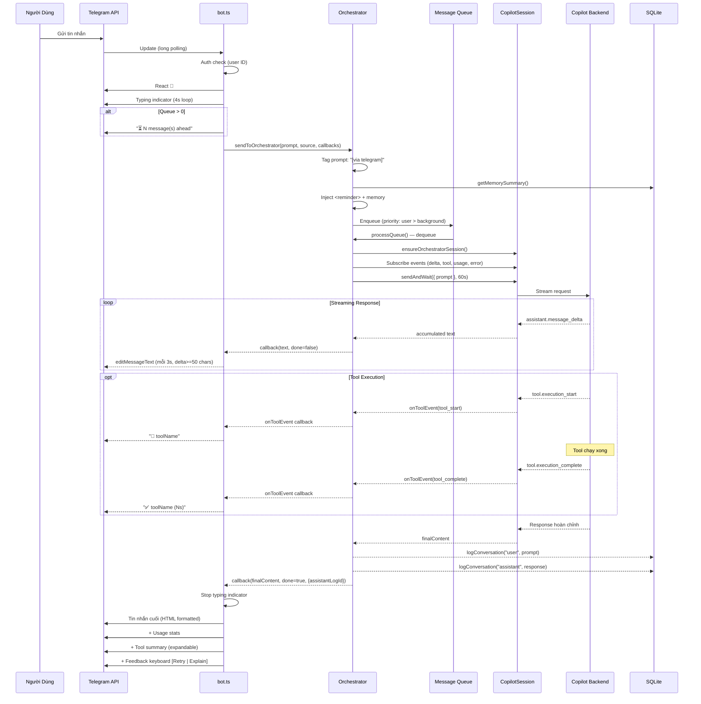
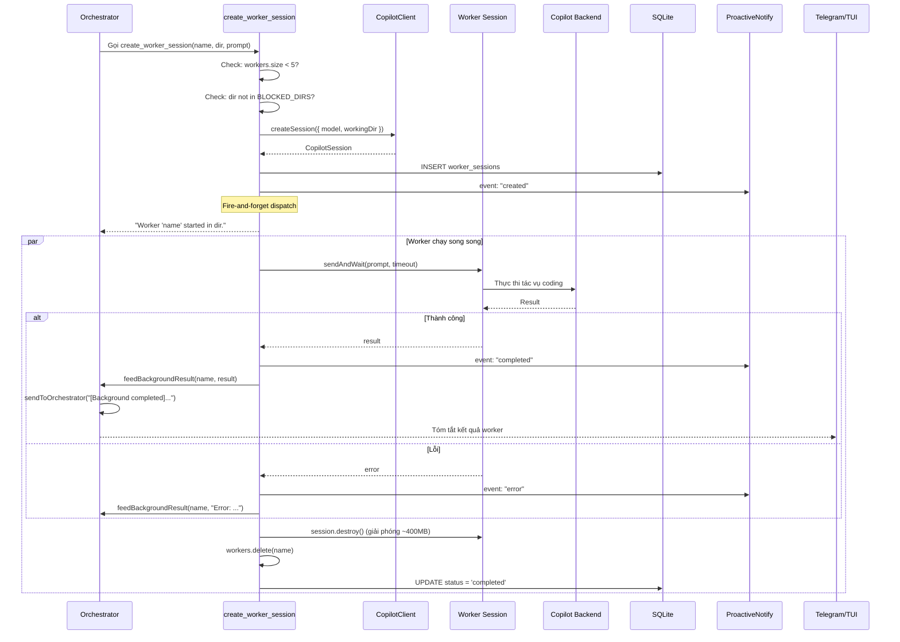
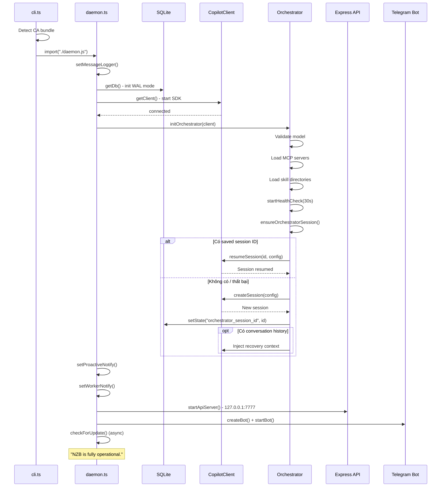
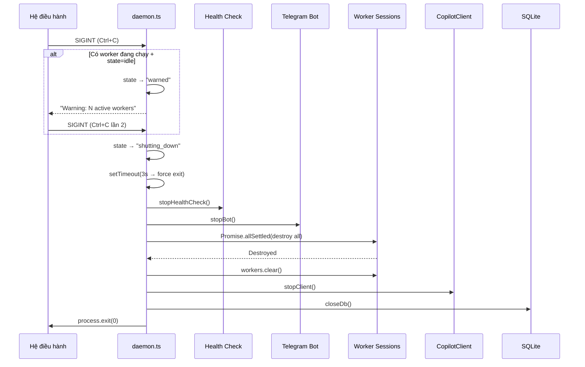

# Tài Liệu Kiến Trúc Hệ Thống NZB

> Tài liệu đặc tả toàn diện về kiến trúc, vòng đời, luồng dữ liệu và cơ chế hoạt động của NZB daemon — một trợ lý AI cá nhân dựa trên GitHub Copilot SDK.

---

## Mục Lục

1. [Tổng Quan Hệ Thống](#1-tổng-quan-hệ-thống)
2. [Kiến Trúc Tổng Thể](#2-kiến-trúc-tổng-thể)
3. [Vòng Đời Khởi Động (Startup Lifecycle)](#3-vòng-đời-khởi-động)
4. [Vòng Đời Tắt Hệ Thống (Shutdown Lifecycle)](#4-vòng-đời-tắt-hệ-thống)
5. [Quản Lý Phiên Orchestrator](#5-quản-lý-phiên-orchestrator)
6. [Luồng Xử Lý Tin Nhắn](#6-luồng-xử-lý-tin-nhắn)
7. [Hệ Thống Worker](#7-hệ-thống-worker)
8. [Telegram Bot](#8-telegram-bot)
9. [HTTP API & SSE](#9-http-api--sse)
10. [Terminal UI (TUI)](#10-terminal-ui-tui)
11. [Cơ Sở Dữ Liệu (SQLite)](#11-cơ-sở-dữ-liệu-sqlite)
12. [Hệ Thống Công Cụ (Tools)](#12-hệ-thống-công-cụ-tools)
13. [Hệ Thống Kỹ Năng (Skills)](#13-hệ-thống-kỹ-năng-skills)
14. [MCP Server](#14-mcp-server)
15. [Hệ Thống Bộ Nhớ Dài Hạn (Memory)](#15-hệ-thống-bộ-nhớ-dài-hạn)
16. [Cấu Hình & Đường Dẫn](#16-cấu-hình--đường-dẫn)
17. [Cơ Chế Xử Lý Lỗi & Retry](#17-cơ-chế-xử-lý-lỗi--retry)
18. [Cơ Chế Health Check](#18-cơ-chế-health-check)
19. [Cơ Chế Restart](#19-cơ-chế-restart)
20. [Bảo Mật](#20-bảo-mật)
21. [Sequence Diagrams](#21-sequence-diagrams)

---

## 1. Tổng Quan Hệ Thống

NZB là một **daemon** (tiến trình nền) chạy liên tục trên máy, hoạt động như một trợ lý AI cá nhân cho lập trình viên. NZB bọc (wrap) GitHub Copilot SDK để quản lý:

- **Một phiên orchestrator duy nhất** — phiên AI chính, tồn tại lâu dài, xử lý tuần tự từng tin nhắn qua hàng đợi
- **Nhiều phiên worker** — các phiên Copilot ngắn hạn, tự hủy sau khi hoàn thành tác vụ coding

Người dùng tương tác qua ba kênh:

| Kênh | Công Nghệ | Mô Tả |
|------|-----------|-------|
| **Telegram Bot** | grammY framework | Bot Telegram với streaming, inline keyboard, reply keyboard |
| **Terminal UI (TUI)** | readline + SSE | Giao diện dòng lệnh kết nối tới daemon qua HTTP SSE |
| **HTTP REST API** | Express v5 | API cục bộ (127.0.0.1) với xác thực bearer token |

### Stack Công Nghệ

| Thành Phần | Công Nghệ | Phiên Bản |
|------------|-----------|-----------|
| Ngôn ngữ | TypeScript (strict mode) | 5.9.x |
| Module | ESM (`"type": "module"`) | Node16 moduleResolution |
| Runtime | Node.js | >=18 |
| AI SDK | `@github/copilot-sdk` | CopilotClient, CopilotSession, defineTool, approveAll |
| Telegram | `grammy` + `@grammyjs/auto-retry` | Bot framework |
| HTTP | `express` v5 | Chỉ bind 127.0.0.1 |
| Database | `better-sqlite3` | WAL mode |
| Validation | `zod` v4 | Schema validation |
| Config | `dotenv` | Từ `~/.nzb/.env` |

---

## 2. Kiến Trúc Tổng Thể

```
                        ┌─────────────────────────────┐
                        │         CLI (cli.ts)         │
                        │  start | tui | setup | update│
                        └─────────────┬───────────────┘
                                      │ start
                                      ▼
                        ┌─────────────────────────────┐
                        │       Daemon (daemon.ts)     │
                        │  main() — khởi tạo toàn bộ  │
                        └──┬──────┬──────┬──────┬─────┘
                           │      │      │      │
              ┌────────────┘      │      │      └────────────┐
              ▼                   ▼      ▼                   ▼
    ┌─────────────────┐  ┌──────────┐  ┌──────────┐  ┌──────────────┐
    │ Orchestrator     │  │ Telegram │  │ HTTP API │  │   SQLite DB  │
    │ (phiên AI chính) │  │   Bot    │  │  + SSE   │  │  (WAL mode)  │
    │                  │  │ (grammY) │  │(Express) │  │              │
    │ ┌──────────────┐ │  └────┬─────┘  └────┬─────┘  └──────────────┘
    │ │ Message Queue│ │       │              │
    │ │ (tuần tự)    │ │       │              │
    │ └──────────────┘ │       │              │
    │                  │       │              │
    │ ┌──────────────┐ │       ▼              ▼
    │ │   Workers    │ │    Người dùng     TUI Client
    │ │ (tối đa 5)  │ │    (Telegram)     (Terminal)
    │ └──────────────┘ │
    └─────────────────┘
```

### Nguyên Tắc Kiến Trúc

1. **Một orchestrator, nhiều worker**: Orchestrator là phiên duy nhất, lâu dài. Worker là phiên tạm thời, tự hủy sau khi xong.
2. **Hàng đợi tuần tự**: Mọi tin nhắn gửi tới orchestrator đều qua hàng đợi. Chỉ xử lý một tin nhắn tại một thời điểm để tránh race condition.
3. **Worker không chặn**: `create_worker_session` và `send_to_worker` gửi tác vụ rồi trả về ngay. Kết quả worker quay lại qua `feedBackgroundResult()`.
4. **Định tuyến theo kênh**: Mỗi worker theo dõi `originChannel` để kết quả hoàn thành được gửi về đúng kênh gốc (Telegram hoặc TUI).

---

## 3. Vòng Đời Khởi Động

Luồng khởi động bắt đầu từ `src/cli.ts` → `src/daemon.ts`:

### 3.1. CLI Entry Point (`src/cli.ts`)

```
nzb start [--self-edit]
     │
     ├─ Phát hiện CA bundle hệ thống (cho corporate TLS inspection)
     │  → Tìm /etc/ssl/certs/ca-certificates.crt hoặc tương đương
     │  → Nếu tìm thấy, set NODE_EXTRA_CA_CERTS và re-exec process
     │
     ├─ Xử lý flag --self-edit → set env NZB_SELF_EDIT=1
     │
     └─ import("./daemon.js") → chạy main()
```

Các lệnh CLI khác:
- `nzb tui` → khởi chạy TUI client (kết nối SSE tới daemon đang chạy)
- `nzb setup` → wizard cấu hình tương tác
- `nzb update` → cập nhật phiên bản từ npm

### 3.2. Khởi Tạo Daemon (`src/daemon.ts` → `main()`)

Thứ tự khởi tạo **tuần tự** (từ trên xuống dưới):

```
main()
  │
  ├─ 1. setMessageLogger()
  │     Gắn hàm log tin nhắn vào daemon console
  │     Format: [nzb] telegram  ⟶  "tin nhắn người dùng..."
  │
  ├─ 2. getDb()
  │     Khởi tạo SQLite database tại ~/.nzb/nzb.db
  │     → WAL mode, tạo bảng nếu chưa có
  │     → worker_sessions, nzb_state, conversation_log, memories
  │
  ├─ 3. getClient()
  │     Khởi tạo CopilotClient singleton
  │     → Kết nối tới GitHub Copilot backend
  │     → Trạng thái: "connected"
  │
  ├─ 4. initOrchestrator(client)
  │     Khởi tạo phiên orchestrator:
  │     → Validate model (nếu khác DEFAULT_MODEL)
  │     → Load MCP servers từ ~/.nzb/mcp.json
  │     → Load skill directories (bundled + local + global)
  │     → Bắt đầu health check (30s interval)
  │     → ensureOrchestratorSession() → resume hoặc tạo mới
  │
  ├─ 5. setProactiveNotify()
  │     Gắn hàm gửi thông báo chủ động (worker hoàn thành, etc.)
  │     → Định tuyến tới Telegram và/hoặc TUI
  │
  ├─ 6. setWorkerNotify()
  │     Gắn hàm thông báo sự kiện worker lifecycle
  │     → ⚙️ created, ▶️ dispatched, ✅ completed, ❌ error
  │
  ├─ 7. startApiServer()
  │     Khởi động HTTP API Express tại 127.0.0.1:7777
  │     → Tạo/đọc bearer token từ ~/.nzb/.api-token
  │
  ├─ 8. createBot() + startBot()
  │     (Chỉ nếu TELEGRAM_BOT_TOKEN và AUTHORIZED_USER_ID được cấu hình)
  │     → Tạo bot grammY với auth middleware, menu, command handlers
  │     → Bắt đầu long polling
  │
  ├─ 9. checkForUpdate() (không chặn)
  │     → Kiểm tra phiên bản mới trên npm registry
  │     → Nếu có update: thông báo qua Telegram + SSE
  │
  └─ 10. Nếu NZB_RESTARTED=1 → gửi "I'm back online." qua Telegram
```

### 3.3. Khởi Tạo Phiên Orchestrator Chi Tiết

```
initOrchestrator(client)
  │
  ├─ Lưu tham chiếu client
  ├─ Tạo tools (cache nếu client chưa đổi)
  ├─ Load mcpServers từ file config
  ├─ Load skillDirectories (3 nguồn)
  │
  ├─ Validate model (nếu != "claude-sonnet-4.6")
  │   → listModels() → kiểm tra có tồn tại
  │   → Nếu không → fallback về DEFAULT_MODEL
  │
  ├─ startHealthCheck() → setInterval 30s
  │
  └─ ensureOrchestratorSession()
       │
       ├─ Kiểm tra có savedSessionId trong SQLite (nzb_state)?
       │
       ├─ CÓ → client.resumeSession(savedSessionId, config)
       │   │     Model, tools, MCP servers, skills, streaming, infinite sessions
       │   │     systemMessage với memory summary
       │   │     onPermissionRequest: approveAll
       │   │
       │   ├─ Thành công → sử dụng phiên cũ
       │   └─ Thất bại → xóa session ID, tạo phiên mới ↓
       │
       └─ KHÔNG / Thất bại → client.createSession(config)
            │
            ├─ Lưu session ID vào SQLite
            │
            └─ Nếu có conversation history cũ (10 tin gần nhất)
                 → Inject context recovery (fire-and-forget, timeout 20s)
                 → "Session recovered. Here's recent conversation..."
```

**Infinite Sessions Config:**
```typescript
{
  enabled: true,
  backgroundCompactionThreshold: 0.8,   // Nén nền khi dùng 80% buffer
  bufferExhaustionThreshold: 0.95,       // Giới hạn cứng 95%
}
```

---

## 4. Vòng Đời Tắt Hệ Thống

Shutdown sử dụng **state machine** 3 trạng thái:

```
                    Ctrl+C (lần 1)
  ┌───────┐    (có worker đang chạy)     ┌─────────┐    Ctrl+C (lần 2)    ┌───────────────┐
  │ idle  │ ─────────────────────────────▶│ warned  │ ────────────────────▶│ shutting_down │
  └───────┘                               └─────────┘                      └───────────────┘
      │                                                                          │
      │ Ctrl+C (không có worker)                                                 │ Ctrl+C (lần 3)
      └──────────────────────────────────▶ shutting_down ───────────────────────▶ process.exit(1)
                                                │
                                                ▼
                                         Trình tự tắt:
                                         1. stopHealthCheck()
                                         2. stopBot() (Telegram)
                                         3. Destroy tất cả worker sessions
                                         4. workers.clear()
                                         5. stopClient() (Copilot SDK)
                                         6. closeDb() (SQLite)
                                         7. process.exit(0)

  ⚠️ Safety: setTimeout 3s → process.exit(1) để đảm bảo tắt được
```

**Chi tiết:**
- Lần Ctrl+C đầu tiên: nếu có worker đang `running`, daemon cảnh báo và chuyển sang `warned`
- Lần Ctrl+C thứ 2: tiến hành shutdown thật sự
- Lần Ctrl+C thứ 3 (trong lúc shutdown): force exit
- Timer 3 giây: nếu shutdown bị treo, tự động force exit

---

## 5. Quản Lý Phiên Orchestrator

### 5.1. Persistent Session

Orchestrator duy trì **một phiên duy nhất** tồn tại qua nhiều tin nhắn và restart:

- **Session ID** được lưu trong SQLite bảng `nzb_state` với key `"orchestrator_session_id"`
- Khi daemon khởi động lại: cố gắng `resumeSession()` trước, tạo mới nếu thất bại
- **Infinite sessions**: SDK tự động nén hội thoại khi buffer đầy (80%), cho phép hội thoại vô hạn

### 5.2. Session Config

Mỗi lần tạo/resume session, cấu hình bao gồm:

```typescript
{
  model: config.copilotModel,           // Mặc định: "claude-sonnet-4.6"
  configDir: SESSIONS_DIR,              // ~/.nzb/sessions/
  streaming: true,                       // Bật streaming response
  systemMessage: { content: "..." },     // System prompt + memory
  tools: [...],                          // 15+ custom tools
  mcpServers: {...},                     // External MCP servers
  skillDirectories: [...],               // Thư mục skill
  onPermissionRequest: approveAll,       // Tự động duyệt mọi quyền
  infiniteSessions: { enabled: true, ... }
}
```

### 5.3. Coalescing

Nhiều lời gọi đồng thời tới `ensureOrchestratorSession()` được **gộp lại** — chỉ một lần tạo session thực sự xảy ra, các lời gọi khác chờ cùng một Promise.

Tương tự, `ensureClient()` gộp các lần reset client đồng thời.

---

## 6. Luồng Xử Lý Tin Nhắn

### 6.1. Tổng Quan

```
Người dùng gửi tin nhắn
       │
       ▼
  ┌──────────────────┐
  │ Kênh đầu vào     │
  │ (Telegram/TUI/API)│
  └────────┬─────────┘
           │
           ▼
  sendToOrchestrator(prompt, source, callback, onToolEvent, onUsage)
           │
           ├─ Gắn tag kênh: "[via telegram] prompt"
           ├─ Inject memory summary: <reminder>...</reminder>
           ├─ Log vào conversation_log (role: "user")
           │
           ▼
  ┌──────────────────────────────────────┐
  │           MESSAGE QUEUE              │
  │                                      │
  │ Quy tắc ưu tiên:                    │
  │ • Tin nhắn user → chèn TRƯỚC        │
  │   background messages                │
  │ • Background (worker result) → cuối │
  │                                      │
  │ Xử lý: tuần tự, một lần một         │
  └──────────────┬───────────────────────┘
                 │
                 ▼
  processQueue() — vòng lặp while
           │
           ▼
  executeOnSession(prompt, callback, onToolEvent, onUsage)
           │
           ├─ ensureOrchestratorSession()
           ├─ Đăng ký event listeners:
           │   • tool.execution_start    → onToolEvent("tool_start")
           │   • tool.execution_complete → onToolEvent("tool_complete")
           │   • assistant.message_delta → tích lũy text, gọi callback(text, false)
           │   • session.error           → log lỗi
           │   • tool.execution_partial_result → onToolEvent("tool_partial_result")
           │   • assistant.usage         → onUsage({inputTokens, outputTokens, model})
           │
           ├─ session.sendAndWait({ prompt }, timeout=60s)
           │
           ├─ Chờ thêm 150ms cho late events (assistant.usage)
           │
           └─ Trả về finalContent
                 │
                 ▼
           callback(finalContent, done=true, { assistantLogId })
           │
           ├─ Log conversation (role: "assistant")
           │
           └─ Nếu timeout → tự động gửi "Continue..." (auto-continue)
```

### 6.2. Priority Queue Chi Tiết

```typescript
// Tin nhắn người dùng: chèn trước background messages
const bgIndex = messageQueue.findIndex(isBackgroundMessage);
if (bgIndex >= 0) {
  messageQueue.splice(bgIndex, 0, item);  // Chèn trước background
} else {
  messageQueue.push(item);                // Hoặc vào cuối nếu không có bg
}

// Tin nhắn background: luôn vào cuối
messageQueue.push(item);
```

### 6.3. Auto-Continue

Khi response bị cắt do timeout:
1. Nội dung tích lũy được gửi kèm dấu hiệu `⏱ Response was cut short (timeout)`
2. Sau 1 giây, tự động gửi: `"Continue from where you left off. Do not repeat what was already said."`
3. Nếu đang ở Telegram: gửi thông báo `🔄 Auto-continuing...`

### 6.4. Retry Logic

```
Gửi tin nhắn → Lỗi?
  │
  ├─ Cancelled/Abort → Dừng ngay, không retry
  │
  ├─ Recoverable error? (timeout, disconnect, EPIPE, ECONNRESET, ...)
  │   │
  │   ├─ attempt < MAX_RETRIES (2)?
  │   │   → sleep(RECONNECT_DELAYS_MS[attempt]) — [1s, 5s]
  │   │   → ensureClient() (reset kết nối)
  │   │   → Retry
  │   │
  │   └─ Đã hết retry → callback("Error: ...", done=true)
  │
  └─ Non-recoverable → callback("Error: ...", done=true)
```

---

## 7. Hệ Thống Worker

### 7.1. Khái Niệm

Worker là **phiên Copilot CLI ngắn hạn** (~400MB RAM mỗi phiên), chạy trong một thư mục cụ thể để thực hiện tác vụ coding. Orchestrator tạo và quản lý worker thông qua các tool.

### 7.2. Giới Hạn

- **Tối đa 5 worker đồng thời** (`MAX_CONCURRENT_WORKERS = 5`)
- Worker tự hủy sau khi hoàn thành hoặc lỗi
- Timeout mặc định: 600 giây (10 phút), cấu hình qua `WORKER_TIMEOUT`

### 7.3. Vòng Đời Worker

```
Orchestrator gọi tool "create_worker_session"
  │
  ├─ Kiểm tra: workers.size >= 5? → Từ chối
  ├─ Kiểm tra: thư mục bị chặn? → Từ chối
  ├─ Kiểm tra: tên trùng? → Từ chối
  │
  ├─ client.createSession({
  │     model, streaming, workingDir,
  │     onPermissionRequest: approveAll
  │   })
  │
  ├─ Lưu vào Map workers: { name, session, workingDir, status: "running", originChannel }
  ├─ Lưu vào SQLite bảng worker_sessions
  ├─ Gửi sự kiện: onWorkerEvent({ type: "created" })
  │
  ├─ Dispatch (fire-and-forget, KHÔNG chặn):
  │   session.sendAndWait(prompt, timeout)
  │     .then(result => {
  │       onWorkerEvent({ type: "completed" })
  │       onWorkerComplete(name, result) → feedBackgroundResult()
  │     })
  │     .catch(err => {
  │       onWorkerEvent({ type: "error", error: msg })
  │       onWorkerComplete(name, "Error: ...")
  │     })
  │     .finally(() => {
  │       session.destroy()     // Giải phóng ~400MB
  │       workers.delete(name)  // Xóa khỏi Map
  │       DB: UPDATE status = 'completed'
  │     })
  │
  └─ Return ngay: "Worker '{name}' started in {dir}."
       (Orchestrator tiếp tục xử lý tin nhắn tiếp theo)
```

### 7.4. Worker Result Feedback

```
Worker hoàn thành
  │
  └─ feedBackgroundResult(workerName, result)
       │
       ├─ Xác định kênh gốc: worker.originChannel
       │
       └─ sendToOrchestrator(
            "[Background task completed] Worker '{name}' finished:\n\n{result}",
            source: { type: "background" },
            callback → proactiveNotifyFn(text, channel)
          )
            │
            └─ Orchestrator đọc kết quả worker
                 → Tóm tắt và gửi về kênh gốc (Telegram/TUI)
```

### 7.5. Thư Mục Bị Chặn

Worker **không được phép** làm việc trong các thư mục nhạy cảm:

```
.ssh, .gnupg, .aws, .azure, .config/gcloud, .kube, .docker, .npmrc, .pypirc
```

### 7.6. Worker Info

```typescript
interface WorkerInfo {
  name: string;              // Tên ngắn, vd: "frontend-fix"
  session: CopilotSession;   // Phiên Copilot
  workingDir: string;        // Thư mục làm việc
  status: "running" | "idle" | "completed" | "error";
  lastOutput?: string;       // Kết quả cuối
  startedAt: Date;           // Thời điểm tạo
  originChannel?: "telegram" | "tui";  // Kênh gốc
}
```

---

## 8. Telegram Bot

### 8.1. Khởi Tạo

```
createBot()
  │
  ├─ Tạo Bot instance (grammY) với HTTPS agent riêng
  │   (bypassProxy — kết nối trực tiếp tới api.telegram.org)
  │
  ├─ Gắn plugin: autoRetry({ maxRetryAttempts: 3, maxDelaySeconds: 10 })
  │
  ├─ Auth middleware (ưu tiên cao nhất):
  │   → Kiểm tra ctx.from?.id === config.authorizedUserId
  │   → Nếu sai → bỏ qua im lặng (không phản hồi)
  │
  ├─ Đăng ký menu:
  │   → Main menu (InlineKeyboard): Status, Model, Workers, Skills, Memory, Settings, Cancel
  │   → Settings sub-menu (InlineKeyboard): Show Reasoning, Toggle Log Channel
  │   → Reply keyboard (persistent): 📊 Status, 🔧 Workers, 📚 Skills, ⚙️ Settings, ❌ Cancel
  │
  ├─ Đăng ký slash commands:
  │   /start, /help, /cancel, /model, /memory, /skills,
  │   /workers, /status, /restart, /settings
  │
  ├─ Đăng ký media handlers:
  │   → on("message:photo")    → downloadPhoto → gửi orchestrator
  │   → on("message:document") → downloadDocument (max 10MB) → gửi orchestrator
  │   → on("message:voice")    → downloadVoice → Whisper transcribe → gửi orchestrator
  │
  └─ Đăng ký text message handler:
       → Xử lý reply-to context
       → Gọi sendToOrchestrator() với streaming callback
```

### 8.2. Luồng Xử Lý Tin Nhắn Text (Chi Tiết)

```
Người dùng gửi tin nhắn text
  │
  ├─ 1. React 👀 (emoji reaction trên tin nhắn gốc)
  │
  ├─ 2. Bắt đầu typing indicator
  │      → ctx.replyWithChatAction("typing") mỗi 4 giây
  │
  ├─ 3. Thông báo hàng đợi (nếu queue > 0)
  │      → "⏳ {n} message(s) ahead — queued"
  │
  ├─ 4. Xử lý reply-to context
  │      → Nếu tin nhắn là reply tới tin nhắn trước
  │      → Tra cứu trong conversation_log bằng telegram_msg_id
  │      → Nối context: "Referring to your earlier response: ..."
  │
  ├─ 5. sendToOrchestrator(prompt, source, callback, onToolEvent, onUsage)
  │
  │      Streaming callback:
  │      ┌─────────────────────────────────────────────────┐
  │      │ Lần gọi đầu tiên (done=false):                 │
  │      │   → Gửi tin nhắn placeholder với nội dung đầu  │
  │      │   → Lưu sentMessageId                          │
  │      │                                                 │
  │      │ Các lần gọi tiếp theo (done=false):            │
  │      │   → Kiểm tra: cách lần edit cuối >= 3 giây?    │
  │      │   → Kiểm tra: delta >= 50 ký tự? (MIN_EDIT_DELTA)│
  │      │   → Nếu đủ → editMessageText (cập nhật nội dung)│
  │      │   → Format: toTelegramHtml() → chunkMessage()  │
  │      │                                                 │
  │      │ done=true:                                      │
  │      │   → Dừng typing indicator                       │
  │      │   → Format cuối cùng + gửi/edit tin nhắn       │
  │      │   → Thêm usage stats (nếu có)                  │
  │      │   → Thêm tool summary (expandable)             │
  │      │   → Thêm feedback keyboard (Retry | Explain)   │
  │      └─────────────────────────────────────────────────┘
  │
  │      Tool event callback:
  │      ┌─────────────────────────────────────────────────┐
  │      │ tool_start:                                     │
  │      │   → "🔧 {toolName}" (+detail nếu có)           │
  │      │   → Gửi tin nhắn tạm (sẽ edit khi complete)    │
  │      │                                                 │
  │      │ tool_complete:                                  │
  │      │   → Edit: "✅ {toolName} ({duration}s)"         │
  │      │   → Lưu vào danh sách tool summary             │
  │      └─────────────────────────────────────────────────┘
  │
  └─ 6. Xử lý lỗi:
         → Xóa reaction 👀
         → Gửi tin nhắn: "⚠️ Error: {msg}"
         → Kèm inline keyboard: [Retry] [Explain Error]
```

### 8.3. Callback Handlers

| Callback | Hành Động |
|----------|-----------|
| `retry` | Lấy tin nhắn gốc từ callback data → gửi lại qua `sendToOrchestrator()` |
| `explain_error` | Gửi "Explain this error and suggest how to fix: {error}" qua orchestrator |

### 8.4. Media Handlers

| Loại | Xử Lý |
|------|--------|
| **Photo** | Download → lưu temp → gửi đường dẫn tới orchestrator: "User sent a photo at: {path}" |
| **Document** | Kiểm tra <= 10MB → download → gửi orchestrator: "User sent a file: {name} at: {path}" |
| **Voice** | Download OGA → gọi OpenAI Whisper API (nếu có OPENAI_API_KEY) → gửi transcript |

### 8.5. Formatter (`formatter.ts`)

Pipeline chuyển đổi markdown → Telegram HTML:

```
Markdown thô
  │
  ├─ 1. Stash code blocks (``` ```) → placeholder
  ├─ 2. Stash inline code (` `) → placeholder
  ├─ 3. Chuyển đổi:
  │      → **bold** → <b>bold</b>
  │      → *italic* → <i>italic</i>
  │      → ~~strike~~ → <s>strike</s>
  │      → [text](url) → <a href="url">text</a>
  │      → ||spoiler|| → <tg-spoiler>spoiler</tg-spoiler>
  │      → > blockquote → <blockquote>text</blockquote>
  │      → Tables → mobile-friendly lists (Header: Value)
  │      → Headings (# ## ###) → <b>text</b>
  │      → Lists (- *) → • text
  ├─ 4. Unstash code blocks → <pre><code class="lang">...</code></pre>
  ├─ 5. Unstash inline code → <code>...</code>
  ├─ 6. Escape ký tự HTML đặc biệt: & < >
  │
  └─ chunkMessage(html, maxLength=4096)
       → Chia tin nhắn theo giới hạn Telegram
       → Ưu tiên chia tại: newline > space > maxLength
       → Đảm bảo HTML tags không bị cắt giữa chừng
```

### 8.6. Log Channel (`log-channel.ts`)

Nếu `LOG_CHANNEL_ID` được cấu hình trong env:
- Gửi log có cấu trúc tới Telegram channel riêng
- Các mức: debug, info, warn, error
- Format: emoji prefix + message

---

## 9. HTTP API & SSE

### 9.1. Cấu Hình Server

- **Bind**: `127.0.0.1` (chỉ local, không expose ra mạng)
- **Port**: `API_PORT` (mặc định 7777)
- **Auth**: Bearer token tự sinh, lưu tại `~/.nzb/.api-token` (permission 0600)

### 9.2. Endpoints

| Method | Path | Auth | Mô Tả |
|--------|------|------|--------|
| GET | `/status` | Không | Trạng thái daemon (model, workers, queue size, uptime) |
| GET | `/sessions` | Có | Danh sách worker sessions đang chạy |
| GET | `/stream` | Có | SSE endpoint — streaming real-time cho TUI |
| POST | `/message` | Có | Gửi tin nhắn tới orchestrator (body: `{ text, connectionId? }`) |
| POST | `/cancel` | Có | Hủy tin nhắn đang xử lý + drain hàng đợi |
| GET | `/model` | Có | Lấy model hiện tại |
| POST | `/model` | Có | Đổi model (body: `{ model }`) |
| GET | `/memory` | Có | Lấy tóm tắt memory |
| GET | `/skills` | Có | Danh sách skill đã cài |
| DELETE | `/skills/:slug` | Có | Xóa skill local |
| POST | `/restart` | Có | Restart daemon |
| POST | `/send-photo` | Có | Relay ảnh tới Telegram (body: `{ url, chatId?, caption? }`) |

### 9.3. SSE Streaming

```
Client (TUI) kết nối → GET /stream
  │
  ├─ Sinh connectionId duy nhất
  ├─ Set headers: Content-Type: text/event-stream, Connection: keep-alive
  ├─ Heartbeat: gửi `:ping\n\n` mỗi 20 giây
  │
  ├─ Khi có dữ liệu (từ orchestrator hoặc proactive):
  │   → event: data
  │   → data: JSON.stringify({ type, content, ... })
  │   → \n\n
  │
  └─ Client ngắt kết nối → xóa khỏi danh sách tracking
```

**Broadcast**: `broadcastToSSE(text)` gửi tin nhắn tới **tất cả** SSE client đang kết nối.

---

## 10. Terminal UI (TUI)

### 10.1. Kiến Trúc

TUI là **client riêng biệt** kết nối tới daemon đang chạy qua HTTP API:

```
TUI Process (nzb tui)
  │
  ├─ Kết nối SSE: GET /stream (với bearer token)
  │   → Nhận streaming response real-time
  │
  ├─ Gửi tin nhắn: POST /message
  │   → { text: "...", connectionId: "..." }
  │
  └─ readline interface
       → History: ~/.nzb/.tui_history (1000 dòng)
       → Prompt: "> "
```

### 10.2. Rendering

TUI sử dụng **markdown-to-ANSI** renderer tùy chỉnh:

| Markdown | ANSI Output |
|----------|-------------|
| `# Heading` | `\x1b[1;36m` (bold cyan) |
| `**bold**` | `\x1b[1m` (bold) |
| `*italic*` | `\x1b[3m` (italic) |
| `` `code` `` | `\x1b[33m` (yellow) |
| ` ```block``` ` | `\x1b[90m` (dim/grey) |
| `- list` | `  • text` |

### 10.3. Streaming Display

```
Nhận SSE event
  │
  ├─ Tích lũy text theo dòng
  ├─ Mỗi khi có dòng hoàn chỉnh:
  │   → Clear dòng hiện tại (ANSI escape)
  │   → Render markdown → ANSI
  │   → In ra terminal
  │
  └─ done=true → In dòng trống, hiển thị prompt
```

---

## 11. Cơ Sở Dữ Liệu (SQLite)

### 11.1. Cấu Hình

- **Đường dẫn**: `~/.nzb/nzb.db`
- **WAL mode**: `pragma journal_mode = WAL` (tăng hiệu năng đồng thời)
- **Prepared statement cache**: Các câu lệnh thường dùng được cache để tái sử dụng

### 11.2. Schema

#### Bảng `worker_sessions`

```sql
CREATE TABLE IF NOT EXISTS worker_sessions (
  name            TEXT PRIMARY KEY,
  copilot_session_id TEXT,
  working_dir     TEXT,
  status          TEXT DEFAULT 'running',  -- running | completed | error
  created_at      DATETIME DEFAULT CURRENT_TIMESTAMP
)
```

Theo dõi vòng đời worker. Khi worker hoàn thành, `status` cập nhật thành `'completed'`.

#### Bảng `nzb_state`

```sql
CREATE TABLE IF NOT EXISTS nzb_state (
  key   TEXT PRIMARY KEY,
  value TEXT
)
```

Lưu trữ key-value đơn giản. Dùng cho:
- `orchestrator_session_id` — ID phiên orchestrator để resume
- Các trạng thái khác của hệ thống

API: `getState(key)`, `setState(key, value)`, `deleteState(key)`

#### Bảng `conversation_log`

```sql
CREATE TABLE IF NOT EXISTS conversation_log (
  id              INTEGER PRIMARY KEY AUTOINCREMENT,
  role            TEXT NOT NULL,           -- user | assistant | system
  content         TEXT NOT NULL,
  source          TEXT DEFAULT 'unknown',  -- telegram | tui | background
  telegram_msg_id INTEGER,                 -- ID tin nhắn Telegram (để reply-to lookup)
  created_at      DATETIME DEFAULT CURRENT_TIMESTAMP
)
```

- Tự động **prune xuống 200 bản ghi** mỗi lần insert
- `getRecentConversation(n)` — lấy n tin nhắn gần nhất (dùng cho session recovery)
- `getConversationContext()` — lấy context cho orchestrator

#### Bảng `memories`

```sql
CREATE TABLE IF NOT EXISTS memories (
  id         INTEGER PRIMARY KEY AUTOINCREMENT,
  category   TEXT NOT NULL,       -- preference | fact | project | person | routine
  content    TEXT NOT NULL,
  source     TEXT DEFAULT 'user', -- user | auto
  created_at DATETIME DEFAULT CURRENT_TIMESTAMP
)
```

- **FTS5** (Full-Text Search): bảng `memories_fts` cho tìm kiếm nhanh
- API: `addMemory()`, `removeMemory()`, `searchMemories(keyword?, category?)`
- `getMemorySummary()` — tạo tóm tắt memory inject vào system message

---

## 12. Hệ Thống Công Cụ (Tools)

Orchestrator có 15+ tool được đăng ký qua `defineTool()` từ Copilot SDK:

### 12.1. Quản Lý Worker

| Tool | Mô Tả |
|------|--------|
| `create_worker_session` | Tạo phiên worker mới trong thư mục chỉ định. Non-blocking, tự hủy sau khi xong. |
| `send_to_worker` | Gửi prompt follow-up tới worker đang tồn tại. |
| `list_sessions` | Liệt kê tất cả worker đang chạy (tên, thư mục, trạng thái, thời gian). |
| `check_session_status` | Kiểm tra trạng thái chi tiết của một worker. |
| `kill_session` | Hủy worker và giải phóng tài nguyên. |
| `list_machine_sessions` | Liệt kê TẤT CẢ phiên Copilot CLI trên máy (đọc từ `~/.copilot/session-state/`). |
| `attach_machine_session` | Attach vào phiên Copilot CLI có sẵn (vd: từ VS Code). |

### 12.2. Quản Lý Skill

| Tool | Mô Tả |
|------|--------|
| `list_skills` | Liệt kê skill đã cài (tên, nguồn, mô tả). |
| `learn_skill` | Tạo skill mới (SKILL.md) với slug, name, description, instructions. |
| `uninstall_skill` | Xóa skill local (~/.nzb/skills/). |

### 12.3. Quản Lý Model

| Tool | Mô Tả |
|------|--------|
| `list_models` | Liệt kê model Copilot khả dụng (id, billing tier, active). |
| `switch_model` | Đổi model. Có hiệu lực từ tin nhắn tiếp theo. Persist qua restart. |

### 12.4. Bộ Nhớ (Memory)

| Tool | Mô Tả |
|------|--------|
| `remember` | Lưu thông tin vào bộ nhớ dài hạn. Phân loại: preference, fact, project, person, routine. |
| `recall` | Tìm kiếm bộ nhớ theo keyword và/hoặc category. |
| `forget` | Xóa memory theo ID. |

### 12.5. Hệ Thống

| Tool | Mô Tả |
|------|--------|
| `restart_nzb` | Restart daemon. Spawn process mới → thoát process cũ. |

### 12.6. Tool Deps Pattern

Tools nhận dependency qua interface `ToolDeps`:

```typescript
interface ToolDeps {
  client: CopilotClient;
  workers: Map<string, WorkerInfo>;
  onWorkerComplete: (name: string, result: string) => void;
  onWorkerEvent: (event: WorkerEvent) => void;
}
```

Tools được **cache** — chỉ tạo lại khi client thay đổi (sau reset).

---

## 13. Hệ Thống Kỹ Năng (Skills)

### 13.1. Cấu Trúc Skill

Mỗi skill là một thư mục chứa `SKILL.md` với YAML frontmatter:

```markdown
---
name: Gmail
description: Send and read emails via Gmail CLI
---

# Gmail Skill

Hướng dẫn sử dụng Gmail CLI...
```

### 13.2. Ba Nguồn Skill (Theo Thứ Tự Ưu Tiên)

| # | Nguồn | Đường Dẫn | Mô Tả |
|---|-------|-----------|--------|
| 1 | Bundled | `<package>/skills/` | Đi kèm package npm |
| 2 | Local | `~/.nzb/skills/<slug>/SKILL.md` | Người dùng tạo qua `learn_skill` |
| 3 | Global | `~/.agents/skills/<slug>/SKILL.md` | Chia sẻ giữa các agent AI |

### 13.3. Dynamic Loading

Skills được **tải lại mỗi tin nhắn** — không cần restart daemon khi thêm/xóa skill.

### 13.4. Tạo Skill

```
learn_skill tool
  │
  ├─ Validate slug: regex ^[a-z0-9]+(-[a-z0-9]+)*$
  ├─ Kiểm tra path traversal: resolve path không escape skills dir
  ├─ Tạo thư mục: ~/.nzb/skills/{slug}/
  ├─ Ghi file: SKILL.md với frontmatter + instructions
  │
  └─ Có hiệu lực ngay từ tin nhắn tiếp theo
```

---

## 14. MCP Server

### 14.1. Config Loading

MCP (Model Context Protocol) servers được load từ file config:

```
Thứ tự ưu tiên:
  1. ~/.nzb/mcp.json (ưu tiên cao)
  2. ~/.copilot/mcp-config.json (fallback)
```

Format:

```json
{
  "mcpServers": {
    "server-name": {
      "command": "npx",
      "args": ["-y", "@mcp/server"],
      "env": { "KEY": "value" }
    }
  }
}
```

### 14.2. WSL Support

Nếu chạy trên WSL, MCP config loader biến đổi wrapper `wsl.exe bash -c "..."` thành lệnh native:

```
Trước: { command: "wsl.exe", args: ["bash", "-c", "actual-command --args"] }
Sau:   { command: "actual-command", args: ["--args"] }
```

### 14.3. Tích Hợp

MCP servers được truyền vào `createSession()` / `resumeSession()` và có sẵn cho orchestrator session sử dụng.

---

## 15. Hệ Thống Bộ Nhớ Dài Hạn

### 15.1. Kiến Trúc Memory

```
                    ┌──────────────────────────┐
                    │     System Message        │
                    │  (chứa memory summary     │
                    │   tại thời điểm tạo       │
                    │   session)                │
                    └──────────────────────────┘

                    ┌──────────────────────────┐
                    │    <reminder> tag         │
                    │  (inject memory tươi      │
                    │   vào mỗi tin nhắn user)  │
                    └──────────────────────────┘
                              │
                              ▼
  ┌─────────────┐    ┌──────────────────┐    ┌──────────────────┐
  │  remember   │───▶│   SQLite DB      │◀───│     recall       │
  │  (tool)     │    │  memories table   │    │    (tool)        │
  └─────────────┘    │  + FTS5 index     │    └──────────────────┘
                     └──────────────────┘
                              ▲
                              │
                     ┌──────────────────┐
                     │     forget        │
                     │    (tool)         │
                     └──────────────────┘
```

### 15.2. Danh Mục Memory

| Category | Mô Tả | Ví Dụ |
|----------|--------|-------|
| `preference` | Sở thích, cài đặt | "User thích dark theme" |
| `fact` | Kiến thức chung | "API key có hiệu lực 30 ngày" |
| `project` | Thông tin dự án | "Repo frontend dùng React 18" |
| `person` | Thông tin về người | "Sếp tên Minh, dùng Slack" |
| `routine` | Thói quen, lịch trình | "Daily standup lúc 9h sáng" |

### 15.3. Memory Injection

Memory được inject vào orchestrator qua hai cơ chế:

1. **System message** — `getMemorySummary()` tại thời điểm tạo session
2. **Mỗi tin nhắn user** — `getMemorySummary()` được inject dạng `<reminder>` tag trước prompt

Điều này đảm bảo memory mới luôn được phản ánh ngay, không cần tạo lại session.

---

## 16. Cấu Hình & Đường Dẫn

### 16.1. Biến Môi Trường

Tất cả config nằm trong `~/.nzb/.env`, validate bởi Zod schema:

| Biến | Giá Trị Mặc Định | Mô Tả |
|------|-------------------|--------|
| `TELEGRAM_BOT_TOKEN` | (bắt buộc nếu dùng Telegram) | Token bot Telegram |
| `AUTHORIZED_USER_ID` | (bắt buộc nếu dùng Telegram) | Telegram user ID cho xác thực |
| `API_PORT` | `7777` | Cổng API server local |
| `COPILOT_MODEL` | `claude-sonnet-4.6` | Model AI mặc định |
| `WORKER_TIMEOUT` | `600000` (ms = 10 phút) | Timeout cho worker |
| `SHOW_REASONING` | `false` | Hiển thị reasoning trong response |
| `LOG_CHANNEL_ID` | (tùy chọn) | Telegram channel ID cho debug log |
| `OPENAI_API_KEY` | (tùy chọn) | Key cho Whisper voice transcription |

### 16.2. Đường Dẫn Hệ Thống

Tất cả đường dẫn tập trung trong `src/paths.ts`:

| Hằng Số | Đường Dẫn | Mô Tả |
|---------|-----------|--------|
| `NZB_HOME` | `~/.nzb/` | Thư mục gốc |
| `DB_PATH` | `~/.nzb/nzb.db` | SQLite database |
| `ENV_PATH` | `~/.nzb/.env` | File cấu hình |
| `SKILLS_DIR` | `~/.nzb/skills/` | Skill local |
| `SESSIONS_DIR` | `~/.nzb/sessions/` | Session config |
| `HISTORY_PATH` | `~/.nzb/.tui_history` | Lịch sử TUI |
| `API_TOKEN_PATH` | `~/.nzb/.api-token` | Bearer token API |
| `TUI_DEBUG_LOG_PATH` | `~/.nzb/.tui-debug.log` | Debug log TUI |

---

## 17. Cơ Chế Xử Lý Lỗi & Retry

### 17.1. Nguyên Tắc Chung

- **Không bao giờ crash daemon**: Mọi tool handler trả về string lỗi thay vì throw
- **Unhandled rejection**: Được bắt ở process level, log nhưng không thoát
- **Uncaught exception**: Thoát process (lỗi nghiêm trọng)

### 17.2. Recoverable Errors

Pattern nhận diện lỗi có thể retry:

```
timeout | disconnect | connection | EPIPE | ECONNRESET |
ECONNREFUSED | socket | closed | ENOENT | spawn |
not found | expired | stale
```

### 17.3. Retry Flow

```
MAX_RETRIES = 2
RECONNECT_DELAYS_MS = [1_000, 5_000]

Attempt 0 → Lỗi recoverable?
  YES → sleep(1s) → ensureClient() → Retry
Attempt 1 → Lỗi recoverable?
  YES → sleep(5s) → ensureClient() → Retry
Attempt 2 → Thất bại cuối cùng → callback("Error: ...")
```

### 17.4. Session Recovery

Khi phát hiện session đã "chết":

```
Lỗi chứa: closed | destroy | disposed | invalid | expired | not found
  │
  ├─ orchestratorSession = undefined
  ├─ deleteState("orchestrator_session_id")
  │
  └─ Lần gọi tiếp theo → ensureOrchestratorSession()
       → Tạo session mới + inject conversation context
```

### 17.5. Timeout Handling

```
session.sendAndWait(prompt, timeout=60s)
  │
  ├─ Timeout xảy ra + có nội dung tích lũy (accumulated > 0)
  │   → Trả về: accumulated + "⏱ Response was cut short (timeout)"
  │   → Auto-continue sau 1 giây
  │
  └─ Timeout xảy ra + không có nội dung
       → Throw error → retry logic
```

---

## 18. Cơ Chế Health Check

```
setInterval(30_000ms)
  │
  └─ Kiểm tra: copilotClient.getState() === "connected"?
       │
       ├─ CÓ → Bỏ qua
       │
       └─ KHÔNG → ensureClient() (reset + reconnect)
            │
            └─ Nếu client thay đổi → orchestratorSession = undefined
                 (buộc tạo session mới ở tin nhắn tiếp theo)
```

Health check đảm bảo daemon luôn sẵn sàng phản hồi, ngay cả khi kết nối bị đứt ngầm.

---

## 19. Cơ Chế Restart

### 19.1. Qua Tool (`restart_nzb`)

```
Tool handler gọi → restartDaemon()
  │
  ├─ Schedule sau 1 giây (để trả response trước)
  │
  └─ restartDaemon()
       ├─ stopHealthCheck()
       ├─ Nếu có worker → cảnh báo + destroy tất cả
       ├─ stopBot() (Telegram)
       ├─ Destroy tất cả worker sessions
       ├─ stopClient() (Copilot SDK)
       ├─ closeDb() (SQLite)
       │
       ├─ spawn(process.execPath, [execArgv + argv], {
       │     detached: true,
       │     stdio: "inherit",
       │     env: { ...env, NZB_RESTARTED: "1" }
       │   })
       ├─ child.unref()
       │
       └─ process.exit(0)
```

### 19.2. Qua Slash Command (`/restart`)

Tương tự — gọi `restartDaemon()` trực tiếp.

### 19.3. Qua API (`POST /restart`)

Tương tự — gọi `restartDaemon()`.

### 19.4. Thông Báo Sau Restart

Khi process mới khởi động với `NZB_RESTARTED=1`:
- Gửi `"I'm back online."` qua Telegram
- Xóa biến env

---

## 20. Bảo Mật

### 20.1. Xác Thực Telegram

```
Mọi tin nhắn Telegram
  │
  └─ Auth middleware (chạy ĐẦU TIÊN):
       ctx.from?.id === config.authorizedUserId?
       │
       ├─ ĐÚNG → Cho phép
       └─ SAI → Bỏ qua im lặng (không phản hồi)
```

### 20.2. Xác Thực API

- **Bearer token** tự sinh bằng `crypto.randomBytes(32)`
- Lưu tại `~/.nzb/.api-token` với permission `0o600` (chỉ owner đọc)
- Mọi endpoint (trừ `/status`) yêu cầu header: `Authorization: Bearer <token>`

### 20.3. Bind Cục Bộ

API server chỉ bind `127.0.0.1` — không thể truy cập từ máy khác trên mạng.

### 20.4. Thư Mục Bị Chặn (Worker)

Worker không được phép làm việc trong:
```
.ssh, .gnupg, .aws, .azure, .config/gcloud,
.kube, .docker, .npmrc, .pypirc
```

### 20.5. Path Traversal Guard (Skills)

- Slug được validate: `^[a-z0-9]+(-[a-z0-9]+)*$`
- Resolved path phải nằm trong skills directory

### 20.6. Self-Edit Protection

- Mặc định: NZB từ chối sửa mã nguồn của chính nó
- Flag `--self-edit` mở khóa tính năng này
- System message chứa chỉ thị bảo vệ khi self-edit tắt

### 20.7. Permission Model

- `approveAll` — tự động duyệt mọi tool permission request từ Copilot SDK
- Bảo mật thực thi ở tầng ứng dụng (blocked dirs, auth, path guards) — không phải qua SDK prompt

---

## 21. Sequence Diagrams

### 21.1. Luồng Tin Nhắn Telegram Hoàn Chỉnh



### 21.2. Luồng Worker Lifecycle



### 21.3. Luồng Khởi Động Hệ Thống



### 21.4. Luồng Shutdown



---

## Phụ Lục: Bản Đồ File

| File | Mô Tả |
|------|--------|
| `src/cli.ts` | Entry point CLI — router lệnh, CA cert injection |
| `src/daemon.ts` | Main daemon — khởi tạo + shutdown + restart |
| `src/config.ts` | Config Zod schema, env loading |
| `src/paths.ts` | Path constants |
| `src/setup.ts` | Setup wizard tương tác |
| `src/update.ts` | Kiểm tra + cài đặt cập nhật npm |
| `src/copilot/client.ts` | CopilotClient singleton |
| `src/copilot/orchestrator.ts` | **Core**: phiên orchestrator, message queue, worker feedback |
| `src/copilot/tools.ts` | 15+ custom tools cho orchestrator |
| `src/copilot/system-message.ts` | System prompt generation |
| `src/copilot/skills.ts` | Skill loading (bundled/local/global) |
| `src/copilot/mcp-config.ts` | MCP server config loading |
| `src/telegram/bot.ts` | Telegram bot — commands, menus, streaming |
| `src/telegram/formatter.ts` | Markdown → Telegram HTML |
| `src/telegram/log-channel.ts` | Debug logging tới Telegram channel |
| `src/telegram/handlers/callbacks.ts` | Inline keyboard callbacks |
| `src/telegram/handlers/media.ts` | Photo/document/voice handlers |
| `src/telegram/handlers/helpers.ts` | Shared reply utilities |
| `src/api/server.ts` | Express HTTP API + SSE |
| `src/tui/index.ts` | Terminal UI client |
| `src/store/db.ts` | SQLite database layer |

---

> **Ghi chú**: Tài liệu này được tạo hoàn toàn dựa trên phân tích mã nguồn thực tế của NZB. Mọi thông tin đều có thể xác minh qua các file mã nguồn tương ứng.
